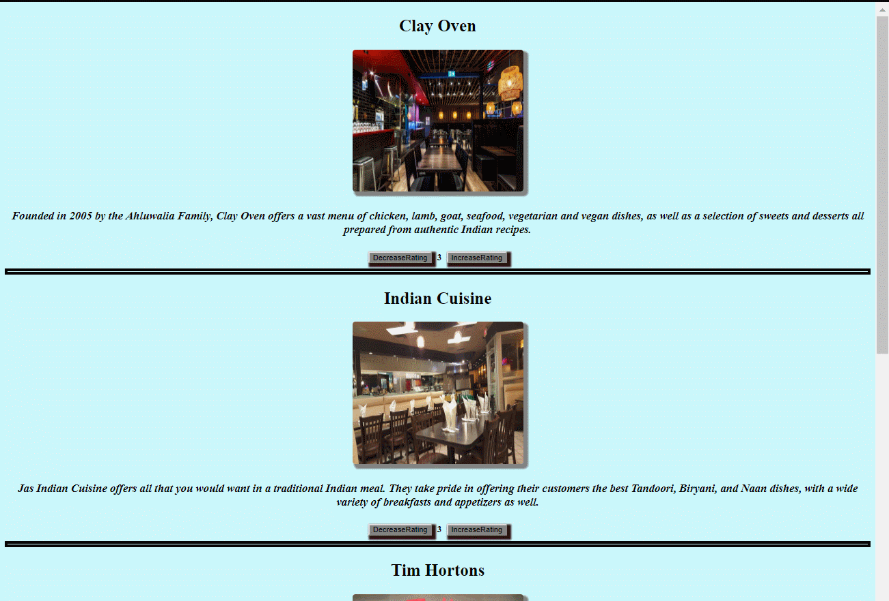

# Restaurant-Reviews-app

This app is made with angular to rate restaurants.

## How to use the app

- The page shows many different restaurants and every restaurant has two buttons _like_ or _dislike_ .
- User can rate the restaurant with the maximum rating of 5 and not less than 1.
- if the rating is greater than 3, background color of that restaurant changes to green and displays a positive message.
- If the rating is less than 3, background color of that restaurant changes to red and displays a negative message.

